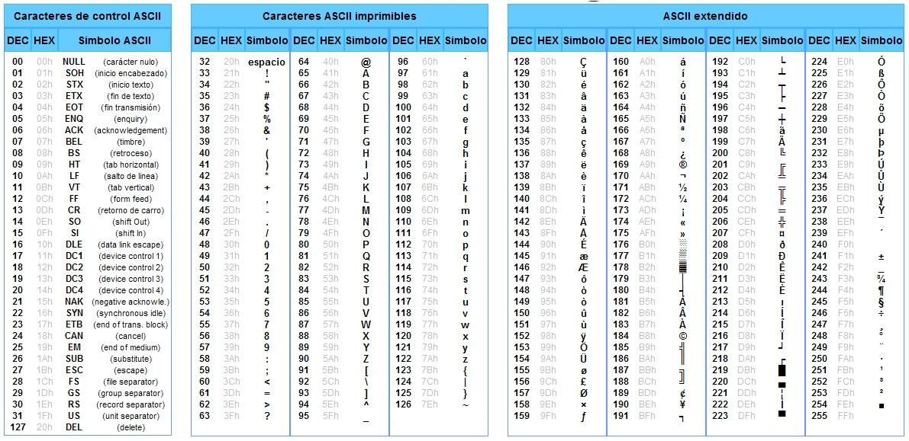

# Apuntes de desarrollo

## Desarrollo con Vite

Alternativa al Webpack

Iniciamos con Vite

```bash
npm init vite@latest apicnig.code -- --template vanilla
cd .\apicnig.play\
npm install
npm run dev
```

## Trabajo con Linters y formateadores de código en Vite

### ESLint

Los linters de código nos ayudan a fijar unas normas de escritura de código tanto en estilo como en sintaxis. **EsLint** es uno de los más utilizados. Para instalarlo

```bash
# El parámetro -D indica que es una dependencia de desarrollo
npm i -D eslint 

# Creación del fichero de configuración .eslintrc.js
npx eslint --init
# Esto abre un asistente. Las opciones más habituales son
# 1- Check syntax, find problems, enforce style code
# 2- Uso de imports/exports 
# 3- Seleccionamos React, Vue o None of these para vanilla JS
# 4- Elegimos o no el uso de Typescript
# 5- Seleccionamos el uso en Browser o node
# 6- Se recomienda una guía de estilos popular: Airbnb es demasiado exigente. Mejor la Stantard de Github
# 7- Formato del fichero de estilos, A mi me gusta JS
```

Para que funcione hay que indicarle el fichero que debe analizar

```bash
## Analizar
npx eslint main.js
## Corregir automáticamente
npx eslint main.js --fix
```

También se puede instalar el plugin ES-Lint de VSCode. Para evitar que se analicen ficheros en las carpetas `dist` o `build` , creamos un fichero `.eslintignore` con el siguiente contenido:

```txt
dist
build
```

### Prettier

Ahora vamos con el formateador de códifo **Prettier**.

```bash
# El parámetro -D indica que es una dependencia de desarrollo
npm i -D prettier 
```

Para que funcione hay que indicarle el fichero que debe analizar

```bash
## Formatear y sacar por consola
npx prettier main.js

## Formatear y modificar el fichero con el resultado del formateo
npx prettier main.js --write

## Obtener la lista de ficheros que tras el análisis habría que corregir
npx prettier --check .
```

Este último comando listará también ficheros de la carpeta `dist` o `build`, según el caso. Hay que indicarle a **Prettier** que no chequee los ficheros de esta carpeta. Para ello creamos el fichero `.prettierignore` con el siguiente contenido:

```txt
dist
build
package-lock.json
```


En el caso de Prettier, el fichero que hay que configurar se llama `.pretierrc`, y su contenido es JSON.

```json

{
  "useTabs": true,
  "singleQuote": true,
  "jsxSingleQuote": true,
  "printWidth": 120, 
  "semicolons": true,
  "trailingComma": "es5",
  "bracketSpacing": true,
}
```
* Trailing Commas son las comas que quedan colgando al escribir la última propiedad de un objeto, como en el objeto anterior.
* Bracket Spacing: dejar espacio antes y después de las llaves o *curly brackets*: `{ foo: bar }`

Al igual que **ESLint**, podemos activar una extensión de VSCode para **Prettier**.

El principal problerma que nos podemos encontrar trabajando conjuntamente con **Prettier** y con **ESlint**, es que sus configuraciones de trabajo sean distintas, y donde uno pone comillas dobles, el otro las ponga simples. Para ello tenenos un paquete que evita esto.

```bash
# El parámetro -D indica que es una dependencia de desarrollo
npm i -D eslint-config-prettier
```

Una vez instalado, copiamos dentro del fichero `.eslintrc.js`, en el apartado extents, lo siguiente. Además añadimos un settings que se usará en proyectos con **React**.

```json
{
  settings:{
    react:{
      version: 'detect'
    }
  },
  (...)
  extends: [
    (...),
    'eslint-config-prettier',
  ]
  (...)
}
```

De esta manera se queda con las reglas de **Prettier** por encima de las de **ESlint** cuan do haya conflicto entre los ficheros de configuración.

Dentro de scripts creamos los comandos

```json
{
"scripts":{
    "dev": "vite",
    "build": "vite build",
    "preview": "vite preview",
    "format": "prettier --write .",
    "lint": "eslint --fix . --ext .js,.jsx",
  }
}
```


## Entendiendo el Base64

En origen el código ASCII se componía de 8 bits, 7 para representar catacreres y 1 bit de control de errores. Con 7 bits se pueden representar 2<sup>7</sup> caracteres, que son 128. A cada uno le corresponde un código del 0 al 127. Los caracteres del 32 [espacio] al 126 [virgulilla ~] son los caracteres imprimibles.



Con estos 128 cracteres iniciales, no se podían representar caracteres como las letras con tilde o la ñ, pñor lo que en 1987 se empezó a desarrollar el código **ASCII extendido**, que utilizaba el octavo bit también para representar información, por lo que pasábamos de 128 a 256 caracteres. Esto se aprobó y definió del todo en la norma ISO/IEC 8889-1:1998.

Sin embargo, esa nueva codificación impedía la comunicación con equipos de impresión. Por ello se creó un código intermedio de 6 bits con todos sus elementos imprimibles, que permitía comunicar equipos con ASCII y **ASCII Extendido**. Con estos seis bits se consiguen codificar 64 caracteres, de ahí su nombre, **Base64**. Se compone de las letras mayúsculas y minúsculas del alfabeto inglés, los numeros del 0 al 9, el signo más + y el signo slash /.


En Javascript es fácil realizar la codificación y decodificación:

```javascript
// Encode string
const encode = window.btoa('Patata');
console.log(`--- ENCODED --- ${encode}`) 
/* --- ENCODED --- cGF0YXRh */

// Decode string
const decode = window.atob('cGF0YXRh');
console.log(`--- DECODED --- ${decode}`) 
/* --- DECODED --- Patata */

// Otra manera
const input='Kello';
const buffer = new Buffer.from(input);
const base64Converted = buffer.toString('base64');
console.log(base64Converted);

const original = buffer.toString('ascii');
console.log(`original ASCII ${original}`)

// Conversión de una imagen
const fs = require('fs');
const fileBuffer = fs.readFileSync('PATH/nombreImagen.jpg');
const base64Image = fileBuffer.toString('base64');
console.log(base64Image);

// Si partimos de una imagen en Base64 almacenada en imageBuffer
const imageBuffer = new Buffer.from(inputImage,'base64');
fs.writeFileSync('foo.jpeg',imageBuffer)

```

Los archivos adjuntos del correo se transmiten en **Base64**.


### Fuentes

* [base64](https://www.base64encode.org/)
* [ESLint y Prettier con Vite](https://www.youtube.com/watch?v=**3BHXuZvI4FI**)